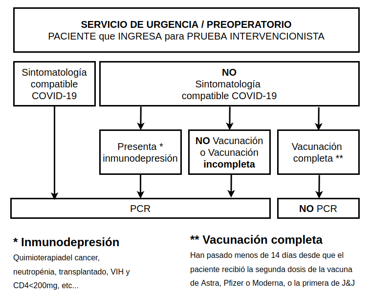

# Verificación de PCR

## Enunciado
La siguiente imagen   
Original   |   Traducción
:----------------------:|:-------------------------:
 |   

es el protocolo que se aplica a un paciente que ingresa en Urgencias para saber si se le ha de aplicar la prueba PCR.

De la sóla imagen se puede extraer el enunciado de la Aplicación Sanitaria que vamos a analizar.

- 1º. La aplicación estará centrada en el **servicio de Urgencias** de un hospital catalán, y específicamente el foco se centra en saber si `Si/No` se debe practicar al paciente una `prueba PCR` a la llegada o INGRESO en el servicio.
- 2º DATOS: De la foto, los datos que podemos inferir y clasificar son:  
    - **Datos de la Vacunación del Paciente**: (Este conjunto de datos es para obtener un Si/No si tiene su pauta completa)  

        `PacienteID`¿?  
        `Fecha última vacuna`  
        `Tipo de vacuna aplicada`  
        `Número de dosis recibidas`  
   
    - **Datos sobre `Sintomatología` compatible (Si/No)**  
    - **Datos sobre `Inmunodepresión` (Si/No)**  
Éstos últimos simularemos que son proporcionados por el sanitario que realice la prueba.  

**Datos generales de la aplicación**, es decir, que no son específicos del Paciente, sino de todos,y son constantes del servicio (reglas del negocio para confirmar la pauta)  
- Datos sobre el Tipo de Vacuna  
    - `Astra`, `Moderna`, `Pfizer`, `J&J`  
- Datos sobre el cumplimiento de la pauta  
    - Días desde la última vacuna = `14`
    - Número de Dosis mínima x Tipo De Vacuna = { `2`, `2`, `2`, `1`}

## Fase1: La Aplicación   
La aplicación, quedará centralizada en una clase (Lógica de Negocio) que contendrá como atributos la lista de pacients ingresados, y los metodos para la gestión de ingreso y alta del paciente, y el método que decide si se realiza la prueba, y lo que necesite.   

## Fase2: Persistencia
Leer el archivo sobre cómo añadir un repositorio u almacén de datos.  
[LEER](READMECreaciónDeUnServicioDeRepositorio.md)

La idea es trabajar las buenas prácticas y la inyección de dependencias.  
Profundizaremos en las colecciones y las funciones como parámetros.  
[LEER](READMEFunciones.md)

